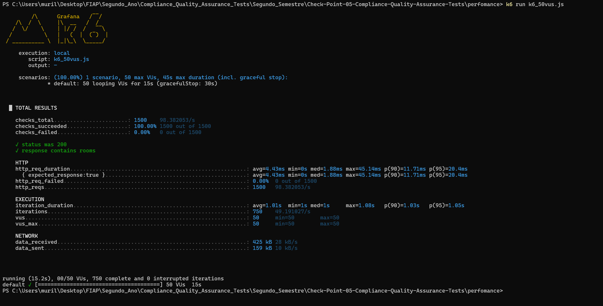

# 📊 Relatório Comparativo - Testes de Performance com K6

Este relatório apresenta a comparação entre os três testes realizados na API `/room` com diferentes volumes de usuários virtuais (VUs), utilizando o K6.

---

## 🧪 Cenários Testados

| Cenário       | VUs | Duração | Requisições | Tempo Médio | p90     | p95     | Falhas | Sucesso | Script              |
|---------------|-----|---------|-------------|-------------|---------|---------|--------|---------|---------------------|
| Teste Leve    | 20  | 10s     | 400         | 18.63 ms    | 50.85ms | 90.78ms | 0%     | 100%    | `k6_20vus.js`       |
| Teste Médio   | 50  | 15s     | 1500        | 4.43 ms     | 11.71ms | 20.40ms | 0%     | 100%    | `k6_50vus.js`       |
| Teste Pesado  | 100 | 20s     | 4000        | 3.16 ms     | 5.00ms  | 11.21ms | 0%     | 100%    | `k6_100vus.js`      |

---

## 🖼 Capturas de Tela

As imagens abaixo mostram a saída dos testes no terminal:

- 
- 
- 

---

## ⚙️ Notas Técnicas

- Os testes foram executados em **ambiente local**
- A API `/room` estava rodando com **Spring Boot na porta 3001**
- O teste foi conduzido com **K6 CLI local**, sem uso de nuvem
- Scripts utilizados estão presentes na pasta `/performance`

---

## 📌 Análise

- **Tempo médio de resposta caiu** conforme aumentamos os VUs — o que demonstra que a aplicação escala bem.
- **Nenhuma falha registrada** em nenhum dos testes.
- **Todos os percentis ficaram abaixo de 100ms** — mesmo sob alta carga.
- A aplicação se manteve **estável e com respostas rápidas em todos os cenários**.

---

## ✅ Conclusão

A API `/room` demonstrou **excelente estabilidade, desempenho e escalabilidade** durante os testes com diferentes volumes de usuários.

---

### 👨‍💻 Desenvolvido por

**Murillo Ferreira Ramos - RM553315**  
**Pedro Luiz Prado Saraiva Pereira - RM553874**

**2TDSPC – FIAP – Abril/2025**
