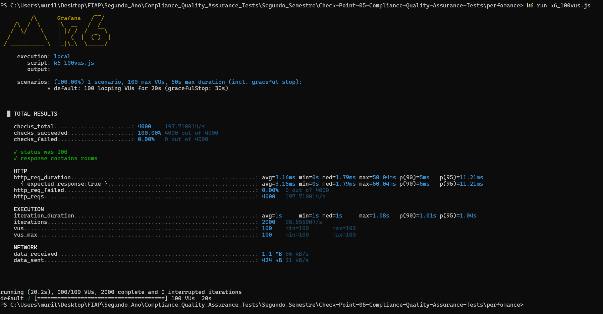

# 📈 Relatório de Teste de Performance - API `/room` - 100 VUs

Este relatório apresenta os resultados do teste com **100 usuários virtuais durante 20 segundos**, utilizando o K6.

---

## 📊 Resumo do teste

- **Total de requisições**: 4000
- **Requisições bem-sucedidas**: ✅ 100% (4000/4000)
- **Tempo médio de resposta**: ⚡ 3.16 ms
- **Mediana (med)**: 1.79 ms
- **Percentil 90 (p90)**: 5.00 ms
- **Percentil 95 (p95)**: 11.21 ms
- **Tempo máximo**: 50.04 ms
- **Falhas**: ❌ 0%
- **Iterações completas**: 🔁 2000
- **VUs simultâneos**: 👥 100
- **Dados recebidos**: 📥 1.1 MB
- **Dados enviados**: 📤 424 KB

---

## 🖼 Captura de tela da execução 

---

## 📌 Interpretação

| Métrica                   | Valor       | Interpretação                               |
|--------------------------|-------------|---------------------------------------------|
| Sucesso nas requisições  | ✅ 100%      | Todas as requisições foram aceitas          |
| Tempo médio               | ⚡ 3.16ms    | Resposta extremamente rápida                |
| Percentil 95              | 🟢 11.21ms   | Estável mesmo sob alta carga                |
| Estabilidade              | 🟢 Alta      | Sem erros ou quedas                         |
| Escalabilidade            | 💪 Ótima     | A API suportou carga alta sem degradação    |

---

## 📜 Script utilizado

[`k6_100vus.js`](./k6_100vus.js)

---

### 👨‍💻 Desenvolvido por

**Murillo Ferreira Ramos - RM553315** \
**Pedro Luiz Prado Saraiva Pereira - RM553874**

**2TDSPC – FIAP – Abril/2025**
