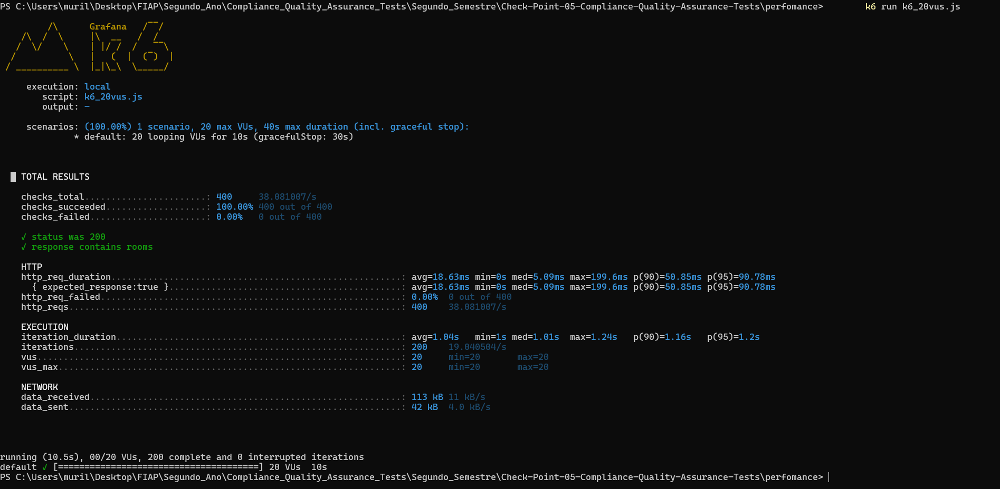

# 📈 Relatório de Testes de Performance - API `/room`

Este relatório apresenta os resultados dos testes realizados com o **K6** na API RESTful do módulo `/room`, simulando diferentes cargas de usuários simultâneos.

---

## ✅ Cenário Atual: 20 usuários virtuais por 10 segundos

### 📊 Resumo

- **Total de requisições**: 400
- **Requisições bem-sucedidas**: 100% (400/400)
- **Tempo médio de resposta**: 18.63 ms
- **Mediana**: 5.09 ms
- **Percentil 90 (p90)**: 50.85 ms
- **Percentil 95 (p95)**: 90.78 ms
- **Máximo**: 199.6 ms
- **Falhas**: 0%
- **Dados recebidos**: 113 KB
- **Dados enviados**: 42 KB

---

## 🖼 Captura de tela da execução 

---

## 📌 Interpretação

| Métrica                    | Valor               | Interpretação                             |
|---------------------------|---------------------|-------------------------------------------|
| Sucesso nas requisições   | ✅ 100%              | Todas as requisições foram aceitas        |
| Média de tempo             | ⚡ 18.63ms           | Excelente tempo de resposta               |
| Percentil 95               | 🟨 90.78ms           | Tempo dentro da tolerância                |
| VUs simultâneos            | 👥 20 usuários       | Simulação de carga moderada               |
| Estabilidade geral         | 🟢 Estável           | Nenhuma falha detectada                   |

---

## 🧪 Sugestões de testes adicionais

Para enriquecer o relatório, recomenda-se também executar:

| Cenário         | VUs | Duração |
|-----------------|-----|---------|
| Teste Estendido | 50  | 30s     |
| Teste Pesado    | 100 | 60s     |

Isso permitirá a construção de **um comparativo de desempenho** entre diferentes níveis de carga.

---

## 📜 Script utilizado

O teste foi executado com o seguinte arquivo de script:

[`k6_20vus.js`](./k6_20vus.js)

---

### 👨‍💻 Desenvolvido por

**Murillo Ferreira Ramos - RM553315** \
**Pedro Luiz Prado Saraiva Pereira - RM553874**

**2TDSPC – FIAP – Abril/2025**
