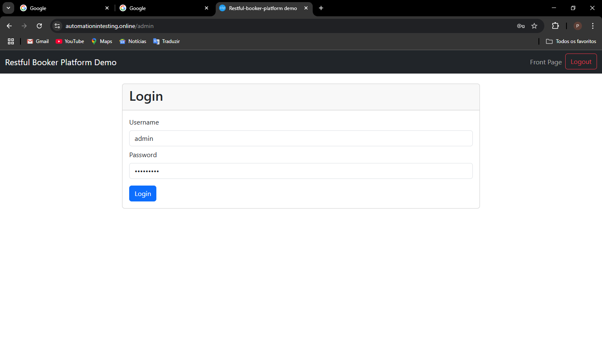

# 🧪 Testes Automatizados - Aplicação Restful Booker Platform

Este diretório contém os testes funcionais automatizados da aplicação **Restful Booker Platform**, utilizando **Selenium WebDriver** com **Python**.  
Os testes simulam ações reais no navegador para verificar se funcionalidades essenciais da aplicação web estão funcionando corretamente.

---

## 📂 Estrutura do Projeto

```
/selenium
├── tests/
│   ├── test_login.py           # Teste de login com sucesso
│   ├── test_room_list.py       # Teste de verificação de lista de quartos
├── evidencias/
│   ├── login_sucesso.png
│   └── rooms_visiveis.png
├── requirements.txt            # Dependências do projeto
└── README_SELENIUM.md          # Este arquivo
```

---

## 🚀 Como executar os testes

### 1. Instalar o Python e o Selenium

Se ainda não tiver instalado, baixe o Python 3.10+ em: https://www.python.org/downloads/

Depois, instale as dependências com:

```bash
pip install -r requirements.txt
```

> O arquivo `requirements.txt` deve conter:
> ```
> selenium
> pytest
> ```

---

### 2. Baixar o WebDriver

Baixe o WebDriver compatível com seu navegador:

- [ChromeDriver](https://chromedriver.chromium.org/downloads)
- [EdgeDriver](https://developer.microsoft.com/en-us/microsoft-edge/tools/webdriver/)

> ⚠️ Salve o driver na mesma pasta dos testes ou adicione ao PATH do sistema.

---

### 3. Executar os testes

Use o `pytest` para rodar os testes:

```bash
pytest tests/
```

---

## 🧪 Testes Implementados

| Teste               | Descrição                                                                 |
|---------------------|---------------------------------------------------------------------------|
| `test_login.py`     | Testa se é possível fazer login com `admin / password`                   |
| `test_room_list.py` | Verifica se a listagem de quartos aparece corretamente após login        |

> ⚙️ Os testes seguem uma estrutura simples baseada em interações reais no navegador. A arquitetura atual pode ser evoluída com o uso do padrão Page Object Model (POM), caso necessário.

---

## 📸 Evidências

Imagens capturadas durante a execução dos testes automatizados:

### Login bem-sucedido


### Lista de quartos visível


---

## 🔗 URL de Teste

Você pode testar localmente com:

```
http://localhost:3003
```

Ou usar a versão online em:

```
https://automationintesting.online
```

---

### 👨‍💻 Desenvolvido por

**Pedro Luiz Prado Saraiva Pereira - RM553874**  
**Murillo Ferreira Ramos - RM553315**

FIAP | 2TDSPC | Abril/2025
